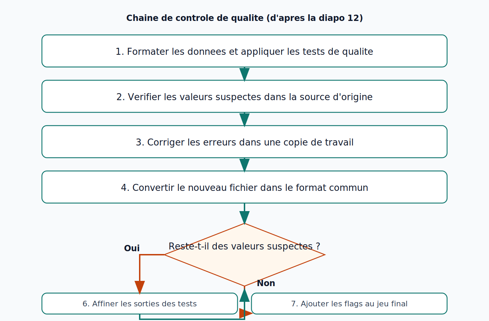
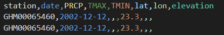
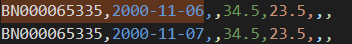
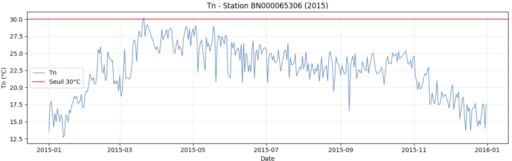
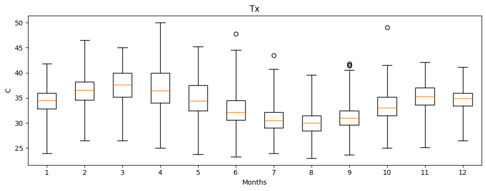

# Contrôle qualité des données climatiques

## Pourquoi un système QC explicite

Le contrôle qualité doit être systématique et cohérent. L'absence de système de gestion de la qualité peut conduire à la perte de données d'origine ou à l'introduction d'erreurs supplémentaires.

## Chaîne de contrôle recommandée

*Lecture pédagogique: après conversion au format commun, on relance les tests; si des valeurs suspectes subsistent, on affine puis on boucle.*

1. Formater les données et appliquer les tests QC.
2. Vérifier les valeurs suspectes dans la source d'origine.
3. Corriger dans une copie de travail (pas dans le brut).
4. Reconvertir le fichier dans le format commun.
5. Relancer les tests.
6. Affiner les sorties: retirer les faux positifs et ajouter les cas non détectés.
7. Ajouter les indicateurs (flags) dans le jeu final.

## Tests standards

## 1. Erreurs grossières

### 1.1 duplicate_dates / duplicate_times

- But: détecter les dates ou instants dupliqués.
- Variables: toutes.
- Sorties: texte (lignes flaggées).

*Lecture pédagogique: un signalement indique un cas à vérifier dans la source d'origine avant toute correction.*

### 1.2 daily_repetition / subdaily_repetition

- But: détecter des séquences de valeurs consécutives identiques.
- Variables: toutes.
- Sorties: texte.

*Lecture pédagogique: une répétition prolongée peut révéler une panne capteur ou une erreur de transmission.*

### 1.3 daily_out_of_range / subdaily_out_of_range

- But: détecter les valeurs hors seuils définis.
- Variables usuelles: Tx, Tn, rr, dd, w, sc, sd.
- Sorties: texte.

*Lecture pédagogique: les seuils doivent être définis selon le contexte climatique local et la variable observée.*

### 1.4 Erreurs grossières OMM (wmo_gross_error)

Description: détecte les observations dépassant des limites recommandées par l’Organisation Météorologique Mondiale. Ces limites dépendent de la latitude et de la saison

Variables: Tx, Tn, ta, w, td, p, mslp

Sorties: Sous forme de texte

Pour latitude <= 45° et latitude >= -45°:

#### Hiver HN, Eté HS (Octobre, Novembre, décembre, janvier, Février, Mars)

- Valeurs suspectes: `-40 <= ta < -30 ou 50 < ta <= 55`
- Valeurs erronées: `ta < -40 ou ta > 55`

#### Eté HN, Hiver HS (Avril, Mai, Juin, Juillet, Août, Septembre)

- Valeurs suspectes: `-30 <= ta < -20 or 50 < ta <= 60`
- Valeurs erronées: `ta < -30 or ta > 60`

## 2. Tolérance statistique

### climatic_outliers

- But: détecter des valeurs rares ou éloignées de la distribution attendue.
- Variables: Tx, Tn, ta, rr, sc, sd, fs.
- Principe: p25 - n*IQR < X < p75 + n*IQR.
- Sorties: texte + figures (boxplots).

*Lecture pédagogique: un outlier statistique n'est pas toujours faux, il doit être interprété avec le contexte météo.*

## 3. Cohérence temporelle

### temporal_coherence

- But: détecter des sauts improbables entre jours successifs.
- Variables usuelles: Tx, Tn, w, sd.
- Sorties: texte.

## Message pédagogique à rappeler

Un flag est un signal d'investigation, pas une suppression automatique de la donnée.
