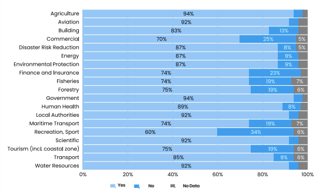

---
hide:
  - toc
---

# Sources de données climatiques et contrôle qualité avec agrometflow

Ce site reprend les axes du support de formation et les réorganise pour un usage en formation :
lecture rapide dans le navigateur, démonstrations exécutables via Binder, et exercices guidés
sans installation lourde sur les machines des apprenants.

[:material-rocket-launch: **Ouvrir le parcours pratique**](notebooks.md){ .md-button .md-button--primary }

[:material-flask: **Lancer Binder**](https://mybinder.org/v2/gh/cyrillemidingoyi/agrometflow/HEAD?urlpath=lab/tree/notebooks/formation_cameroon){ .md-button }

[:fontawesome-brands-github: **Voir le dépôt**](https://github.com/cyrillemidingoyi/agrometflow){ .md-button }

---

## Ce que couvre la formation

!!! example "1. Importance des données climatiques"

    Sans données climatiques fiables, les décisions agronomiques (semis, fertilisation, irrigation, alerte sécheresse) deviennent incertaines.

    

    **Message clé :** qualité des décisions = qualité des données + qualité du contrôle qualité.

!!! example "2. Typologies de données"

    Observations in situ, télédétection, réanalyses et projections climatiques.

    Le fil directeur : comprendre ce que chaque famille apporte et où sont ses limites.

    **[:octicons-arrow-right-24: Voir les sources de données](sources.md)**

!!! example "3. Infrastructures d'accès"

    GHCN-D, GSOD, NASA POWER, CHIRPS, IMERG, ARC2, ERA5, ERA5-Land, MERRA-2 et autres produits déjà présents dans agrometflow.

    **[:octicons-arrow-right-24: Voir les sources de données](sources.md)**

!!! example "4. Contrôle qualité"

    Chaîne QC complète : détection, vérification à la source, correction traçable, relance des tests, ajout des flags.

    **[:octicons-arrow-right-24: Voir le contrôle qualité](controle-qualite.md)**

---

## Parcours pédagogique proposé

!!! note "Étape 1 · Importance des données climatiques"

    Poser l'enjeu métier : une donnée inadaptée ou non contrôlée peut induire un mauvais diagnostic agroclimatique.

!!! note "Étape 2 · Typologies de données"

    Présenter les typologies de sources et les compromis : couverture, résolution, biais, métadonnées, disponibilité opérationnelle.

!!! note "Étape 3 · Infrastructures d'accès"

    Montrer comment agrometflow référence déjà plusieurs produits utiles pour la pluviométrie, la température et l'analyse agroclimatique.

!!! note "Étape 4 · Contrôle qualité"

    Introduire la chaîne QC complète : détecter, vérifier à la source, corriger de manière traçable, relancer les tests.

!!! note "Étape 5 · Étude pratique et discussion métier"

    Faire manipuler des notebooks courts, puis comparer ce qui est acceptable pour le suivi saisonnier, le conseil agricole, la recherche et la calibration de modèles.

---

## Messages clés

!!! info "Approche hybride recommandée"

    Les données satellitaires sont indispensables pour la couverture globale, mais elles ne remplacent pas les stations. La bonne pratique reste l'approche hybride : **stations + satellite + réanalyse + correction locale des biais**.

- :material-antenna: Les observations in situ restent la **référence**, mais souffrent souvent de faible densité et de problèmes de métadonnées.
- :material-satellite-variant: Les produits satellitaires améliorent la **couverture spatiale**, mais gardent des biais régionaux, saisonniers et liés au type de pluie.
- :material-chart-timeline-variant: Les réanalyses offrent une série **cohérente et complète**, mais leur résolution et leurs biais doivent être explicitement discutés.

---

## Format de séance conseillé

| Durée | Contenu |
| ----- | ------- |
| **30 min** | Cadrage sur les familles de données climatiques |
| **30 min** | Portails et produits utiles en Afrique centrale et de l'Ouest |
| **45 min** | Démonstration agrometflow avec Binder |
| **45 min** | Exercices en petits groupes et restitution |

!!! warning "Connexion instable ?"

    Privilégiez les notebooks 00-02 (hors ligne) et gardez le notebook 03 (NASA POWER) pour la démonstration magistrale.

---

## Raccourcis vers les notebooks

| Notebook | Objectif | Niveau | Mode |
| -------- | -------- | ------ | ---- |
| [00 · Parcours sources climatiques](notebooks.md) | Lien entre le cours et les catalogues internes d'agrometflow | :material-star: débutant | hors ligne |
| [01 · Explorer les sources agrometflow](notebooks.md) | Comparer produits, variables et liens utiles | :material-star: débutant | hors ligne |
| [02 · Contrôle qualité journalier](notebooks.md) | Comprendre les flags à partir d'une série simple | :material-star-half-full: intermédiaire | hors ligne |
| [03 · Démarrage NASA POWER](notebooks.md) | Premier téléchargement réel sur un point au Cameroun | :material-star-half-full: intermédiaire | internet requis |
